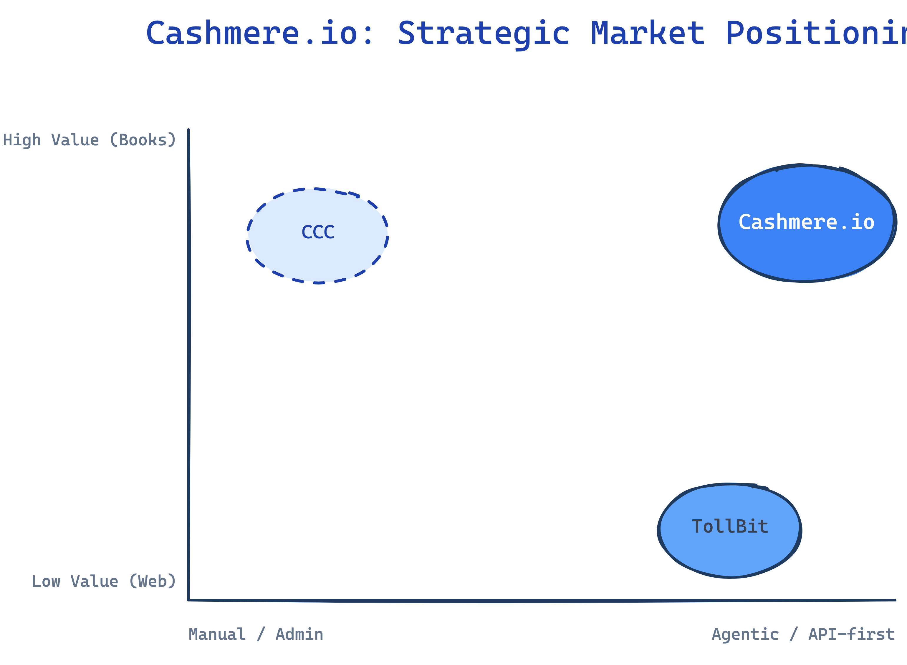
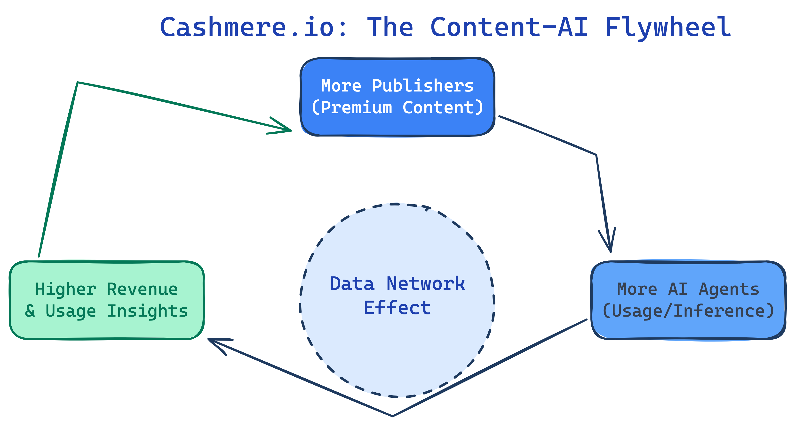

# Investment Memorandum: Cashmere.io (Project Vandal)

**Date**: March 15, 2026
**Stage**: Seed (High Growth)
**Recommendation**: **OVERWEIGHT / HIGH CONVICTION**

**External Profiles**: [Crunchbase](https://www.crunchbase.com/organization/cashmere-io) | [Reach Capital Portfolio](https://reachcapital.com/portfolio/cashmere/) | [Cashmere.io](https://cashmere.io/)

---

## 1. Executive Summary & Thesis
We recommend a high-conviction allocation into **Cashmere.io** (Vandal AI, Inc.), a Salt Lake City-based infrastructure platform that serves as the commercial and technical rails for the publishing industry to navigate the AI economy. Cashmere has uniquely positioned itself as the "Stripe for AI Content," addressing the existential threat AI poses to publishers by turning their archives into secure, monetizable assets. 

**The Thesis**: Cashmere is the only player focusing specifically on the **"Inference-Time" economy**. While most competitors are fighting over one-time, bulk training licenses, Cashmere has built the infrastructure for metered, pay-per-use access at the moment of AI reasoning. This model captures the recurring value of high-fidelity data, aligning the incentives of premium publishers (Wiley, Harvard Business Publishing) with the leading AI search engines (Perplexity).

---

## 2. Strategic Moat: The Infrastructure Gateway
Cashmere’s primary moat is not just its early mover advantage, but its proprietary **Omnipub** knowledge graph format and the **Fiber Gateway**. Unlike generic RAG (Retrieval-Augmented Generation), Omnipub maintains the semantic integrity and granular metadata of long-form content, allowing AI agents to cite specific "habits" or "clinical findings" without ever seeing the full source text.

As shown in the positioning matrix, Cashmere operates at the intersection of **High-Value Content** and **Agentic/API-first Integration**, leaving competitors like TollBit to handle low-value web scraping and CCC to manage legacy administrative licensing.

---

## 3. Founder Alpha: The "Publishing-AI" Bridge
The founding team, led by **Jonathan Munk** and **Jonathan Woahn**, represents the rare "Bridge Talent" required to win this category. Munk’s background as CEO of BookClub and COO of Degreed provides him with the operational scars and relationships within the EdTech and corporate learning sectors. Woahn’s deep philosophical and technical work on the "3C's" (Consent, Credit, Compensation) has earned him the trust of the "Big Five" academic publishers, a group notoriously resistant to new technology.

---

## 4. The Content-AI Flywheel
Cashmere’s growth is driven by a powerful network effect. As more premium publishers ingest their content into Omnipub, the "Fiber Gateway" becomes more valuable to AI search agents like Perplexity, which in turn drives higher usage and richer insights for the publishers.

---

## 5. Critical Risk Assessment

| Risk Factor | Severity | Mitigation Strategy |
| :--- | :--- | :--- |
| **Aggregator Disintermediation** | 🔴 CRITICAL | Cashmere’s "BYOL" model creates a direct link between publishers and institutional subscribers, making it harder for OpenAI/Google to bypass. |
| **Adoption Velocity** | 🟠 MATERIAL | The Perplexity partnership provides immediate, high-volume proof of concept, incentivizing other publishers to join the network. |
| **Model Decoupling** | 🟡 MONITOR | Omnipub is model-agnostic, allowing publishers to switch between LLM providers (Anthropic, Meta, etc.) without re-ingesting content. |

---

## 6. Conclusion
Cashmere.io is a category-defining infrastructure play. With a $5M Seed round led by Reach Capital and a strategic client in Perplexity, they have the capital and the distribution to own the "Premium AI Data" layer. We expect 8x-12x ARR exit multiples as they scale toward a Series A.

---
*End of Overview Memo*
