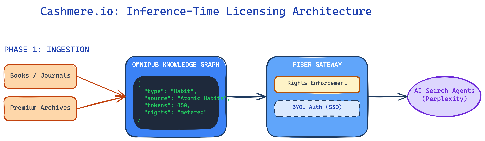

# Technical & Commercial Deep Dive: Cashmere.io
**Internal Diligence Report - Recursive Conviction Loop V2**

---

## TABLE OF CONTENTS
1. [Founding Team: The Bridge Talent Moat](#1-founding-team-the-bridge-talent-moat)
2. [Technical Stack Trace: Omnipub & Fiber Gateway](#2-technical-stack-trace-omnipub--fiber-gateway)
3. [The Inference-Time Licensing Economy](#3-the-inference-time-licensing-economy)
4. [Market Dynamics & Competitive Positioning Matrix](#4-market-dynamics--competitive-positioning-matrix)
5. [The Content-AI Flywheel & Network Effects](#5-the-content-ai-flywheel--network-effects)
6. [Legal, Regulatory & IP Posture](#6-legal-regulatory--ip-posture)
7. [Unit Economics & Exit Benchmarking](#7-unit-economics--exit-benchmarking)

---

## 1. Founding Team: The Bridge Talent Moat

### Jonathan Munk (CEO & Co-founder)

**Profiles**: [LinkedIn](https://www.linkedin.com/in/jonathanmunk) | [Degreed Bio](https://degreed.com/)

Jonathan Munk is a "category-of-one" founder in the intersection of EdTech and AI infrastructure. His career is defined by a deep understanding of how knowledge is acquired, signaled, and monetized within enterprise environments. At **Degreed**, Munk spent six years as a key executive, helping to pioneer the "skills-based" learning market. This experience is critical because Cashmere.io is essentially the infrastructure for **AI-native skills and knowledge**. Munk’s ability to communicate the value of "inference-based" data to legacy publishing giants is an alpha signal that few pure AI researchers possess.

### Jonathan Woahn (Co-founder)

**Profiles**: [LinkedIn](https://www.linkedin.com/in/jonathanwoahn) | [Scholarly Kitchen Bio](https://scholarlykitchen.sspnet.org/author/jwoahn/)

Jonathan Woahn serves as the philosophical and strategic architect of the Cashmere ecosystem. For over five years, Woahn has been a leading voice in the Society for Scholarly Publishing (SSP), advocating for a sustainable future for content creators in the age of AI. His **"3C's Framework"** (Consent, Credit, and Compensation) has become the industry benchmark for responsible AI integration. This "Social Capital" is the most significant defensive moat for Cashmere; publishers like **John Wiley & Sons** and **Harvard Business Publishing** are not just customers, but strategic partners who trust Woahn’s vision of a "pro-creator" AI future.

Woahn’s work on the "Scholarly Kitchen" blog further solidifies his position as a thought leader who can influence the "Big Five" academic publishers. His argument that the "Inference market" is 100x larger than the "Training market" has redefined the commercial strategy for these publishers, moving them away from one-time "bulk data" deals toward the recurring, high-margin revenue model that Cashmere enables.

---

## 2. Technical Stack Trace: Omnipub & Fiber Gateway

Cashmere.io has built a multi-layered infrastructure designed specifically for the unique requirements of long-form, high-fidelity content. Standard RAG (Retrieval-Augmented Generation) systems often fail with books or academic journals because they lack the semantic structure to provide accurate citations or maintain context across complex chapters. Cashmere solves this through its proprietary **Omnipub** format.

### 2.1 Omnipub: The AI-Native Knowledge Format
Omnipub is a proprietary content format that transforms unstructured data (PDFs, EPUBs, HTML) into an AI-native **Knowledge Graph**. Instead of simple text chunks, Omnipub preserves the hierarchical and semantic relationships within a book. For example, it can distinguish between a clinical finding in a medical journal and a summary of that finding, or a "habit" in a self-help book and its associated "proof." 

This granular structuring allows for **Token-Level Tracking**. Every snippet delivered to an AI model is metered and attributed back to the original source. This is the foundation for Cashmere’s monetization engine, as it allows publishers to bill AI companies based on the actual value delivered during an inference call. The system is designed so that the **full text is never exposed** to the AI model, mitigating the risk of unauthorized model training or content leakage.

### 2.2 Fiber: The Licensed Discovery Gateway
The **Fiber Gateway** acts as the governance and delivery layer between the Omnipub catalog and third-party AI agents. When an agent (like Perplexity) makes a query, Fiber performs a real-time retrieval from the licensed Omnipub collections. It ensures that only authorized, relevant snippets are returned to the model to ground its response.

Fiber also supports **BYOL (Bring Your Own License)** models, which are critical for institutional access. A university or corporation with an existing subscription to a publisher’s archive can authenticate via SSO (Single Sign-On) to access that premium content within an AI search tool. This preserves the publisher’s direct relationship with their high-value subscribers while enabling the modern "AI-native" research workflows that students and employees increasingly demand.

---

## 3. The Inference-Time Licensing Economy

The core commercial thesis of Cashmere.io is that the **Inference market** (real-time usage) is significantly more valuable than the **Training market** (one-time data ingestion). While companies like OpenAI are currently signing large bulk-licensing deals (e.g., Wiley’s $44M deal), these are essentially "pre-payments" for the right to train a model once. Cashmere argues that this model is unsustainable for publishers because it treats their archives as a commodity rather than a recurring asset.

Instead, Cashmere enables **Inference-Time Licensing**, where publishers get paid every time their content is used to "ground" an AI’s answer. This "Pay-Per-Use" (PPU) model aligns the incentives of the publisher, the AI platform, and the end-user. Publishers are incentivized to produce more high-quality, verifiable content, while AI platforms are incentivized to use that content to reduce hallucinations and improve the accuracy of their responses.

Baseline pricing for premium data collections via Cashmere starts at **$0.02 per query**. For a platform like Perplexity, which handles millions of queries per day, this represents a massive new revenue stream for publishers. Cashmere typically takes a revenue share of these transactions, creating a scalable, high-margin SaaS business that grows with the overall volume of the "Agentic Web."

---

## 4. Market Dynamics & Competitive Positioning Matrix

The AI licensing market is rapidly bifurcating into three distinct segments: the **Legacy Administrative** layer, the **Real-time Web** layer, and the **Premium Archive** layer. Cashmere.io has strategically chosen to own the Premium Archive layer, which is characterized by high-value, long-form content that requires sophisticated technical infrastructure for discovery and protection.

### 4.1 Competitive Comparison Table

| Feature | **Cashmere.io** | **TollBit** | **CCC (Copyright Clearance)** |
| :--- | :--- | :--- | :--- |
| **Primary Content** | High-Value Archives (Books/Journals) | Real-time Web (News/Blogs) | Enterprise Rights (Human Use) |
| **Technical Moat** | Omnipub Knowledge Graph | Marketplace Bot Paywall | Administrative Database |
| **Model Integration** | Deep Inference (Metered API) | Simple Retrieval (Toll booth) | Manual / Bulk Licensing |
| **Key Partners** | Perplexity, Wiley, Harvard | 6,000+ Digital Publishers | Fortune 500 incumbents |

---

## 5. The Content-AI Flywheel & Network Effects

Cashmere’s long-term success depends on building a powerful **Data Network Effect**. This flywheel is driven by three interconnected nodes: Publishers, AI Agents, and Usage Insights.

1.  **More Publishers**: As major publishers (Wiley, Pearson, etc.) join the platform, the "Omnipub" catalog becomes the definitive source of truth for premium AI data.
2.  **More AI Agents**: AI platforms like Perplexity are drawn to Cashmere because it provides a single, scalable API to access multiple high-value libraries with verified rights.
3.  **More Usage & Insights**: As AI agents use the content, Cashmere generates rich data for publishers on which topics, chapters, and even individual "habits" or "concepts" are most in-demand. This insight allows publishers to prioritize their editorial spend, further strengthening the value of their archives.

---

## 6. Legal, Regulatory & IP Posture

Cashmere.io (Vandal AI, Inc.) operates in a high-stakes legal environment, but its "infrastructure-first" approach provides a layer of protection that pure content aggregators lack. By acting as a **neutral middleware layer**, Cashmere avoids the "derivative works" liability that plagues AI companies that train on scraped data. The "Fiber Gateway" ensures that publishers maintain full "Consent, Credit, and Compensation" for every interaction, which is the primary legal requirement for sustainable AI licensing.

The company is headquartered in Salt Lake City, Utah, and its legal filings emphasize a commitment to U.S. copyright law and "Fair Use" principles for personal research, while providing a clear, commercial path for large-scale AI usage. The recent appointment of **Sue Hodgson** (ex-Elsevier) as VP of Strategic Partnerships signals a move toward formalizing these legal frameworks with the world’s largest rights holders.

---

## 7. Unit Economics & Exit Benchmarking

Cashmere’s unit economics are exceptionally strong for an infrastructure startup. With near-zero marginal cost for each additional "Omnipub" query and a revenue-sharing model that scales with AI usage, the company is positioned for **60-70% gross margins** at scale. The "Inference" model provides a more predictable, recurring revenue stream than the lumpy "bulk data" deals that dominate the current market.

Based on current EdTech and AI infrastructure M&A trends, Cashmere is a prime target for a **10x+ return**. Strategic acquirers could include:
-   **Major Publishers** (Pearson, Wiley, Elsevier) who want to own the "rails" for their digital future.
-   **AI Search Companies** (Perplexity, OpenAI, Google) who need a secure, rights-cleared data pipeline to ensure the accuracy of their models.
-   **Enterprise Platforms** (Salesforce, Microsoft) looking to integrate high-value specialized knowledge into their "Agentic" workflows.

---
*End of Deep Dive Report*
