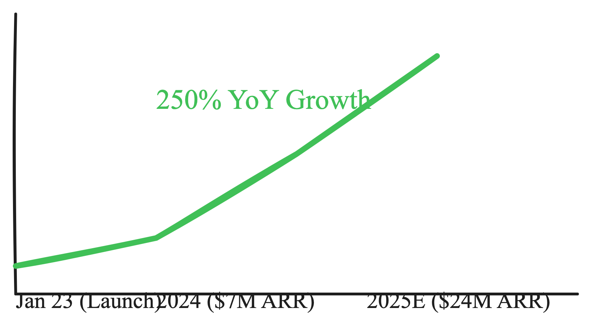

# Technical & Commercial Deep Dive: GPTZero Inc.
**Internal Diligence Report - Recursive Conviction Loop V2**

---

## 1. Founding Team: The Narrative & Technical Bridge
GPTZero’s primary moat begins with its founders, who represent a perfect "Bridge Talent" pair for the AI Governance sector.

- **Edward Tian (CEO)**: A double major in Computer Science and Journalism from Princeton, Tian understood the social impact of LLMs before they became a global phenomenon. His senior thesis was the prototype for GPTZero, giving him a "Founder Alpha" rooted in early academic exploration. His ability to frame the company as a "protector of humanity" vs. a "cheating catcher" has allowed GPTZero to maintain student goodwill where competitors like Turnitin have failed.
- **Alex Cui (CTO)**: An ML heavyweight from the University of Toronto (supervised by Raquel Urtasun) and Caltech. Cui’s background in autonomous driving (Waabi, Uber ATG) brings a level of engineering rigor to "detection" that is typically reserved for high-stakes robotics. His transition from self-driving perception to "textual perception" has been the catalyst for GPTZero’s multi-layer 7-component detection pipeline.

## 2. Technical Architecture: Moving from Product to Process

The core technical thesis of GPTZero is that **detection is an arms race, but provenance is a moat.**

### 2.1 The 7-Layer Detection Pipeline
GPTZero does not rely on a single model. It uses a hierarchical ensemble:
1.  **Statistical Layer**: Perplexity and Burstiness scores provide a fast, low-cost baseline.
2.  **Linguistic Fingerprinting**: A deep learning layer trained on a proprietary corpus of 600M+ documents identifies "structural monotonicities" unique to LLMs.
3.  **Adversarial Shield**: A dedicated module to detect homoglyph attacks, zero-width space injections, and "forced error" patterns used by "humanizing" bypass tools.
4.  **Specialized Modules**: The Education Module includes an ESL-tuned bias-correction layer, significantly reducing false positives for non-native English speakers.

### 2.2 The Authorship Moat: GPTZero Docs
The company’s most significant technical innovation is **Authorship Verification**. By integrating directly into Google Docs and tracking writing telemetry (typing speed, digraph micro-delays, paste events), GPTZero can prove *how* a document was written. This browser-level telemetry is nearly impossible to fake using current LLM bypass techniques, creating a technical moat that Turnitin and Grammarly have yet to replicate.

## 3. Commercial Moat: Data & Network Effects

GPTZero is leveraging its "Viral Bottom-Up" start to build an "Enterprise Top-Down" giant.

- **The Database Moat**: With over 600 million scans performed, GPTZero owns one of the largest datasets of verified human vs. AI-generated text in the world.
- **AI Training Data Licensing**: As frontier labs (OpenAI, Anthropic) worry about "Model Collapse," GPTZero has pivoted to licensing its human-verified datasets to these labs. This creates a high-margin revenue stream that scales with the growth of the AI industry itself.
- **Institutional Lock-in**: The partnership with the American Federation of Teachers (1.8M members) and deep LMS integrations (Canvas, Moodle) creates high switching costs for educational institutions.

## 4. Market & Exit Benchmarks

The exit comps for this sector are strong, with Turnitin serving as the North Star.

- **Comp**: Turnitin was acquired for **$1.75 Billion** at a ~10x revenue multiple.
- **Trajectory**: GPTZero reached **profitability** in 18 months and is growing at **250% YoY**. Its 2025 ARR estimate of ~$24M puts it on a path toward a $500M+ valuation in its next round, with a potential $2B+ exit as the "AI Verification Layer."

## 5. Risk Assessment (The "Sherlocking" Test)
The biggest risk is "Sherlocking" by OpenAI or Microsoft. However, OpenAI's recent decision to sunset its own detector due to inaccuracy validates GPTZero’s specialized focus. GPTZero’s browser-level telemetry (GPTZero Docs) provides a data source that OpenAI does not currently utilize, further insulating the company from platform-level risk.

---
*End of Deep Dive Report*
