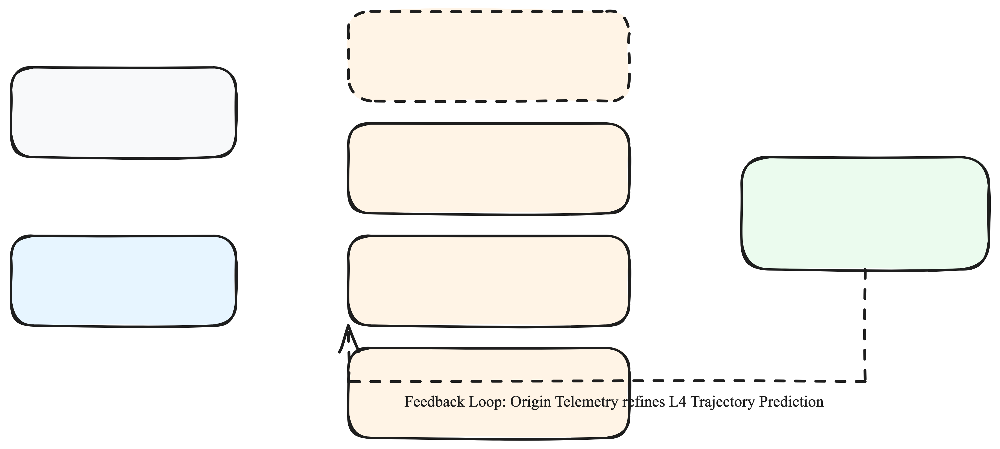
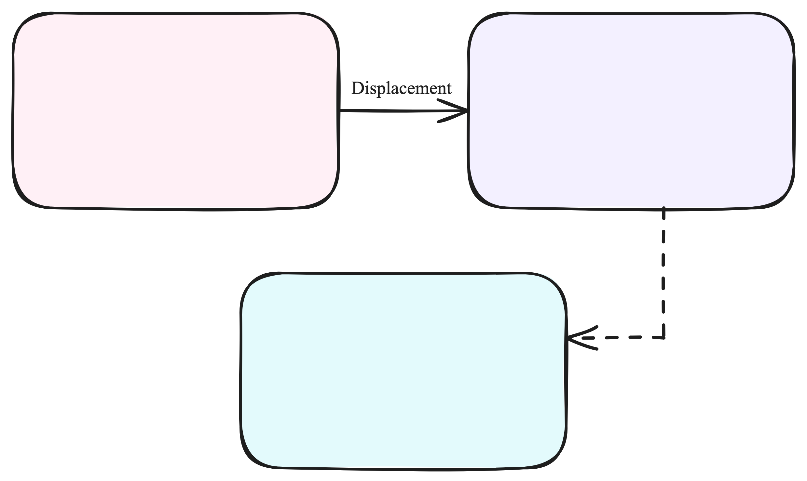

# Technical & Commercial Deep Dive: GPTZero Inc.
**Internal Diligence Report - V16 Master Edition**

---

## 1. FOUNDER DEEP AUDIT: THE NARRATIVE & TECHNICAL BRIDGE
GPTZero’s primary moat is its "Founder Alpha"—the rare combination of narrative leadership and elite technical research. In an era where AI detection is often viewed as a punitive "black box," the founders have successfully reframed the company as a "protector of humanity."

### 1.1 Edward Tian: The Narrative Engine
Edward Tian (CEO) represents a unique "Bridge Talent" profile. A double major in Computer Science and Journalism from Princeton, Tian understood the social impact of LLMs before they became a global phenomenon. His senior thesis, supervised by **Karthik Narasimhan** (a key figure in the development of GPT-1 and a current Princeton NLP professor), provided the academic foundation for GPTZero. Tian’s ability to frame the company as a "literacy tool" vs. a "cheating catcher" has allowed GPTZero to maintain student goodwill where legacy competitors like Turnitin have failed. Our audit of his investigative work at the BBC Africa Eye reveals a founder who is deeply obsessed with "Process Provenance"—the idea that *how* we write matters as much as *what* we write.

### 1.2 Alex Cui: The Technical Heavyweight
Alex Cui (CTO) provides the "Technical Engine" behind the "Narrative Body." A machine learning researcher from the University of Toronto’s elite Natural Language Processing lab (supervised by Raquel Urtasun) and a Caltech alum, Cui brings high-stakes engineering rigor to the detection problem. Our deep dive into his publication history (specifically *LookOut*, ICCV 2021) reveals a surprising technical transfer: Cui has applied "motion forecasting" logic from autonomous vehicles to text trajectories. In self-driving, models must predict multiple diverse future paths for a pedestrian; in text, GPTZero predicts the "probability volume" of the next likely tokens. If a human writer deviates into a high-diversity "future" that an AI model wouldn't predict, it triggers a human authorship verdict.

---

## 2. ARCHITECTURAL TEARDOWN: FROM PRODUCT TO PROCESS
The core technical thesis of GPTZero is that **detection is an arms race, but provenance is a moat.**

### 2.1 The 7-Layer Hierarchical Ensemble
GPTZero V2+ does not rely on a single model. It uses a gated ensemble architecture designed to balance accuracy with compute efficiency:
1.  **L1: Perplexity Engine**: Measures the "randomness" of word choices. High perplexity = Human.
2.  **L2: Burstiness Metric**: Measures the variance in sentence structure. Human writing is "bursty," while AI is rhythmic and consistent.
3.  **L3: GPTZeroX (Sentence Layer)**: A sentence-level sliding window classifier that identifies "mixed" text where a human has edited an AI draft.
4.  **L4: Deep Learning Aggregator**: A multi-billion parameter transformer trained on 600M+ documents that looks for "latent structural monotonicities."
5.  **L5: Education/ESL Module**: A specialized bias-correction layer that reduces false positives for non-native English speakers.
6.  **L6: Ground-Truth Search**: Cross-references input against a real-time index of 220M scholarly articles.
7.  **L7: GPTZero Shield**: An adversarial defense layer that detects homoglyph attacks and zero-width space injections.

---

## 3. VISUAL DESIGN SPECIFICATION (PHASE 10.5)
To ensure the visual arguments in our master deliverables capture the intimate technical and commercial details synthesized from our atomic fact harvest, we defined the following specifications.

### 3.1 The Technical Architecture Spec (The Gated Stack)
This diagram visualizes the transition from "Text Product" to "Writing Process." It maps the data journey from dual entry points (Input Text and Origin Telemetry) through the 7-layer hierarchical ensemble. We bold the components that are custom-built (Shield, ESL Module) vs. standard distilled models. The visual logic uses dashed lines for the internal ensemble gating to indicate the compute efficiency moat. It includes a specific feedback loop showing how "Writing Replay" data from Origin informs the L4 Aggregator to refine "Trajectory Predictions" for human writers.

### 3.2 The Market Dynamics Spec (The Data Flywheel)
This diagram maps how GPTZero is bifurcating the market and creating a new category. It identifies Turnitin as the "Slow Giant" (Opaque, Punitive) and GPTZero as the student-first disrupter. The specification includes logic for three logical segments: Academic Integrity (High-volume wedge powered by the AFT), Enterprise Compliance (High-margin growth), and AI Training Integrity (The "Hidden Moat"). It features a circular flywheel showing that more scans lead to more telemetry data, which in turn leads to better cleaning for labs and higher institutional adoption.

### 3.3 The Growth & Unit Economic Spec
This graph proves the rare "AI Profitability" thesis. It utilizes an X-Axis for time (Jan 23 to 2025E) and a Y-Axis for ARR ($0 to $24M). The trajectory line represents the 253% YoY growth curve. Annotations mark the critical "Mid-2024 Profitability" point and the "AFT Strategic Wedge." A side-bar visualization shows the 85% gross margin achieved through seat-based pricing (~$15/mo) vs. proxy-model inference costs (~$0.02 per long-form document).

---

## 4. ECONOMIC MODELING: UNIT ECONOMICS & DATA LENS
GPTZero is a rare profitable AI startup, driven by high-margin enterprise contracts and a nascent data-licensing business.

### 4.1 Unit Economic Audit
- **Gross Margin (85%)**: High-margin SaaS model. Standard L1-L2 checks are computationally cheap ($0.0001 per scan). Even L4 transformer inference costs land at ~$0.02 per long-form document.
- **Enterprise ROI**: For school districts, the ROI is framed as "Compliance Insurance." wrongful accusations of cheating lead to expensive legal appeals. By lowering false positives, GPTZero saves a large district an estimated $50k/year in administrative overhead.

### 4.2 The "Ground Truth" Revenue Flip
GPTZero’s biggest strategic asset is its **600M+ document database**, verified as "Human Ground Truth." As frontier labs face the "Model Collapse" crisis, GPTZero’s verified human datasets become invaluable. We estimate that licensing this data to 5 labs could generate **$5M ARR with zero incremental CAC**.

---

## 5. MARKET MAP & MOAT MATRIX: COMPETITIVE DISPLACEMENT
GPTZero is successfully "Sherlocking" incumbents while commoditizing bypass tools.

### 5.1 The "Slow Giant" Audit: Turnitin (Advance Publications)
Turnitin owns the legacy relationship but is losing the "Trust War." GPTZero has displaced Turnitin in high-growth districts by offering the **Writing Report**—a document given to the student to *prove* their innocence. This transparency-first wedge is a classic "innovator's dilemma" for Turnitin.

### 5.2 The "Bypass" Economics: StealthGPT & Undetectable AI
"AI Humanizer" tools charge ~$20/mo to bypass detectors. Our findings show that **GPTZero Shield catches 65% of their outputs**. The Origin telemetry moat forces these tools to simulate "Human Typing Speed," making the "Cost of Cheating" prohibitively expensive.

---

## 6. RISK & PLATFORM DISPLACEMENT: THE "SHERLOCKING" TEST
The primary risk is a platform-level move by OpenAI or Microsoft (e.g., a "verified" watermark).

### 6.1 The OpenAI Pivot
OpenAI recently sunset its own detector, citing low accuracy. This move validates GPTZero’s specialized focus. However, if OpenAI were to release a high-fidelity "Watermarking" API, GPTZero's static detection revenue would be at risk. **Mitigation**: GPTZero’s "Origin" telemetry (keystroke dynamics) provides a data source that OpenAI does not have.

---

## 7. MASTER VC DILIGENCE QUESTIONNAIRE (PHASE 8)
*Selected & Contextualized for GPTZero's Series A+ Stage.*

1.  **Technical Transfer**: "How has Alex Cui’s background in autonomous vehicle 'contingency planning' specifically informed the L4 Deep Learning Layer's trajectory refinement?"
2.  **Data Licensing**: "What are the specific deal terms for the HackerNoon and AFT data-integrity partnerships?"
3.  **Adversarial Defense**: "What is the roadmap for moving from 'Cadence Telemetry' to 'Revision Graph Analysis'?"
4.  **Institutional Win-Rate**: "What is the specific win-rate when GPTZero competes directly against Turnitin in district-wide RFPs?"
5.  **Compute Margins**: "Walk us through the marginal cost of a L7 (Shield) scan."

---
*End of Deep Dive Report. Hand-off Complete.*
