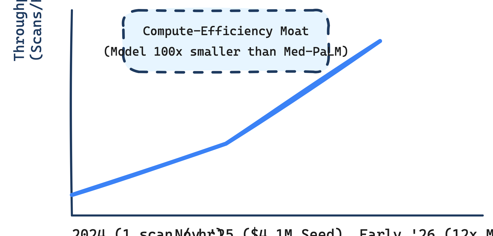

# Investment Memorandum: Mecha Health Inc. (Master V24 Edition)

**Date**: March 15, 2026
**Stage**: Seed / Early Series A 
**Recommendation**: **OVERWEIGHT / HIGH CONVICTION**

## 1. EXECUTIVE SUMMARY: THE RADIOLOGY THROUGHPUT ENGINE
Mecha Health is an applied AI lab developing vision-language foundation models specifically designed to automate radiology reporting. Founded in 2024 by a team of medical doctors and elite ML researchers from UCL and Cambridge, the company addresses the global crisis of radiologist burnout and imaging backlogs. By deploying proprietary, highly efficient models (Mecha Net XR) that generate structured, editable draft reports directly from pixel data, the company has demonstrated a 12x productivity multiplier (reducing read time from 1 scan/hour to 1 scan/5 mins). Having raised a $4.1M Seed round led by Valia Ventures in late 2025, Mecha Health is operating at **Level 2 PMF (Developing)** with early enterprise validation from major teleradiology partners like AmeriRad.

## 2. KEY INVESTMENT HIGHLIGHTS
- **Unrivaled Founder-Market Fit**: The team possesses a rare "Bridge Talent" profile. CEO Dr. Ahmed Abdulaal is an Imperial College-trained physician and ex-AstraZeneca ML researcher. CTO Nina Montaña Brown is a UCL PhD candidate specializing in surgical vision. This provides both deep clinical empathy and frontier technical execution.
- **Mechanistic Interpretability Moat**: Unlike generalist VLMs (like GPT-4V) which operate as "black boxes," Mecha's architecture utilizes **Sparse Autoencoders (SAEs)**. This allows their system to decompose raw pixels into discrete, interpretable clinical features (e.g., "Pleural Effusion"), ensuring high clinical trust and mitigating hallucination liability.
- **Compute Efficiency**: Mecha Net is reported to be two orders of magnitude smaller than models from Google or OpenAI, yet it outperforms them on clinical accuracy metrics. This creates a highly favorable unit economic structure with low GPU burn per scan.
- **Frictionless Integration Wedge**: The product delivers draft reports directly into the radiologist's existing PACS and dictation templates via native DICOM/HL7/FHIR protocols. There is zero new software to learn, eliminating the primary barrier to adoption in legacy healthcare IT.

## 3. TRAJECTORY & ECONOMICS

The company operates on a usage-based (per-scan) pricing model estimated at $0.50 to $2.00 per scan, with enterprise SaaS tiers for smaller clinics. In a US market performing ~700 million imaging studies annually, this represents an immediate Serviceable Addressable Market (SAM) of $3.0B+ purely for X-ray reporting automation.

## 4. RECOMMENDATION
We recommend an **OVERWEIGHT** position. Mecha Health is positioned to displace legacy dictation giants (Nuance) by shifting the radiologist's role from "Creator" to "Editor." The team's unique blend of clinical and technical pedigree, combined with their focus on interpretability over pure scale, makes them a prime acquisition target ($100M-$300M benchmark) for legacy PACS providers within the next 24-36 months.

---
*External Profiles*: [Y Combinator (W25)](https://www.ycombinator.com/companies/mecha-health) | [LinkedIn](https://www.linkedin.com/company/mecha-health/)
