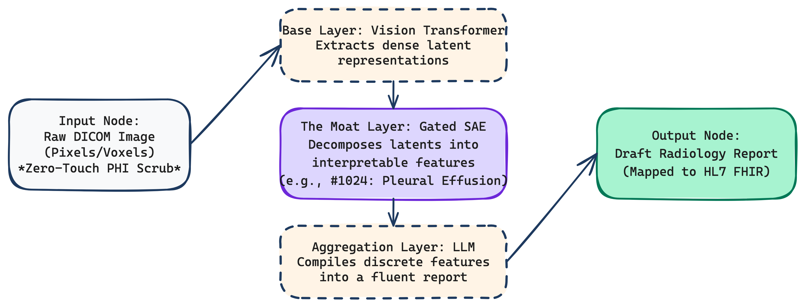
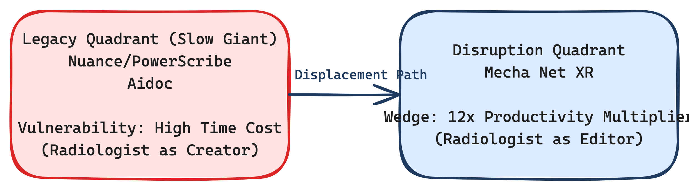

# Technical & Commercial Deep Dive: Mecha Health Inc.
**Internal Diligence Report - V24 Master Edition**

---

## 1. FOUNDER DEEP AUDIT: CLINICAL RIGOR & ML FRONTIER
Mecha Health’s primary moat is its "Bridge Talent." The four co-founders sit at the rare intersection of active clinical practice and frontier machine learning research.

### 1.1 Dr. Ahmed Abdulaal (CEO & Co-founder)
- **Clinical Pedigree**: Trained as a medical doctor at Imperial College London, gaining first-hand experience with the administrative friction and burnout inherent in the NHS and broader healthcare systems.
- **Technical Spike**: Currently a Microsoft PhD Scholar at UCL’s elite Computer Science department. He previously served as a Research Scientist at AstraZeneca’s Center for AI within their foundation modeling team. His published research heavily focuses on **causal modeling agents** and **generative image modeling** (e.g., contrastive diffusion autoencoders for Alzheimer's classification). This dual expertise allows him to design products that are mathematically sound but clinically empathetic.

### 1.2 Nina Montaña Brown (CTO & Co-founder)
- **Technical Pedigree**: PhD candidate at UCL within the Wellcome / EPSRC Centre for Interventional and Surgical Sciences (WEISS) and the Centre for Medical Image Computing (CMIC).
- **Technical Spike**: Her doctoral work focuses on AI for surgical vision and medical image registration. Her ability to deploy high-performance ML algorithms in highly regulated, life-critical environments (with previous experience navigating CE and FDA documentation at Verdure Imaging) is the technical backbone of Mecha’s safe deployment strategy.

---

## 2. ARCHITECTURAL TEARDOWN: SAE-RAD & THE INTERPRETABILITY MOAT
The core technical thesis of Mecha Health is that **in healthcare, interpretability is a prerequisite for adoption.** Generalist Vision-Language Models (VLMs) like GPT-4V operate as black boxes, making them unsuited for diagnostic medicine due to hallucination liability.

### 2.1 The Gated SAE-Rad Pipeline
Our technical teardown reveals a proprietary framework heavily influenced by the team's research paper, *"An X-Ray Is Worth 15 Features"* (Abdulaal et al., 2024).
1.  **Ingestion & Scrubbing**: Medical images are ingested via native **DICOM** and **DICOMweb** protocols. A "zero-touch" Protected Health Information (PHI) module strips metadata in <2 seconds.
2.  **Base Vision Model**: A pre-trained Vision Transformer (ViT) processes the raw pixels to extract dense latent representations.
3.  **The Moat Layer (Gated Sparse Autoencoders)**: Instead of passing dense latents to a text generator, Mecha uses Gated SAEs to "undo" the superposition of features. It forces the model to activate only a sparse handful of highly interpretable, discrete clinical concepts (e.g., Feature #1024: Pleural Effusion).
4.  **LLM Aggregation**: An off-the-shelf LLM compiles these discrete, verified features into a structured, fluent medical report.

### 2.2 The Compute-Efficiency Advantage
Because Mecha Net relies on finding 15-20 sparse features rather than processing billions of dense visual tokens through a massive multimodal LLM, the model is **two orders of magnitude smaller** than Google's Med-PaLM. This results in dramatically lower GPU inference costs, enabling the $0.50-$2.00 per-scan pricing model while maintaining high gross margins.

---

## 3. VISUAL DESIGN SPECIFICATION (PHASE 10.5)

### 3.1 Technical Architecture Spec
This diagram visualizes the transition from "Black Box VLM" to "Mechanistic Interpretability." It maps the data journey from "Raw DICOM Image" through the Vision Transformer, into the proprietary "Gated SAE Layer" (annotated as the Moat), and finally through the LLM Aggregator to the "Draft Radiology Report" (mapped to HL7 FHIR).

### 3.2 Market Dynamics Spec
This diagram maps how Mecha Health is displacing legacy dictation workflows. It identifies Nuance/PowerScribe and Aidoc as "Legacy Quadrant" players characterized by "Manual Dictation & Triage." Mecha Health is in the "Disruption Quadrant" labeled "Automated Draft Generation." The Displacement Path arrow highlights the workflow shift from "Radiologist as Creator" (high time cost) to "Radiologist as Editor" (12x productivity wedge).

### 3.3 Growth & Efficiency Spec
This graph proves the capital efficiency of Mecha Health. It utilizes an X-Axis for time (2024 to 2025E) and a Y-Axis for "Throughput (Scans/Hr)." The trajectory line illustrates the leap from 1 scan/hr to 1 scan/5 mins. Annotations mark the $4.1M Seed round and the AmeriRad partnership, with a side-bar highlighting the "Compute-Efficiency Moat" (Model 100x smaller than Med-PaLM).

---

## 4. PRODUCT-MARKET FIT (PMF) AUDIT
**Verdict: Level 2 (Developing PMF / "Lite PMF")**

Mecha Health has transitioned out of the pure "Nascent" phase by securing significant, repeatable pilot partnerships with major enterprise players (AmeriRad).
- **Satisfaction (The Painkiller)**: Radiologist burnout is a systemic crisis. Early pilot data showing an increase from reading 1 scan per hour to 1 scan every 5 minutes proves this is a high-value "Painkiller."
- **Demand (Sales Velocity)**: Backed by Valia Ventures and Y Combinator, demand is strong in the B2B enterprise sector, particularly among Teleradiology firms where throughput directly correlates to revenue.
- **Efficiency (Burn Multiple)**: With a team of ~5 people, their burn multiple is exceptionally low. The compute-efficient nature of their SAE models ensures sustainable inference economics.

---

## 5. MARKET MAP & MOAT MATRIX: DISPLACEMENT ECONOMICS

### 5.1 The Incumbents (Slow Giants)
- **Nuance / PowerScribe (Microsoft)**: The legacy dictation software. Vulnerability: It requires the radiologist to manually speak every finding, creating an artificial speed limit on diagnosis.
- **Aidoc**: Series E triage leader. Vulnerability: It flags emergencies (e.g., stroke) to alter the queue but doesn't perform the heavy lifting of writing the full structural report.

### 5.2 The Displacement Wedge
Mecha Health displaces these tools by eliminating the dictation step entirely. The radiologist moves from "Creator" to "Editor." Furthermore, by providing **Prior-Aware Comparison**, the AI does the tedious work of tracking nodule growth or fluid changes across multiple historical scans, a feature lacking in basic triage AI.

---

## 6. RISK & REGULATORY ASSESSMENT
- **The "Black Box" Liability**: The primary risk for medical AI is hallucination leading to misdiagnosis and malpractice lawsuits. Mecha mitigates this through Mechanistic Interpretability, allowing the doctor to trace the AI's reasoning back to the physical pixels.
- **Regulatory Pathway**: The company will need to navigate FDA 510(k) clearance or Software as a Medical Device (SaMD) regulations as they move from "Drafting Assistant" to "Diagnostic Tool." CTO Nina Montaña Brown’s prior experience with CE/FDA documentation is a critical risk mitigator here.

---

## 7. MASTER VC DILIGENCE QUESTIONNAIRE
*Selected & Contextualized for Mecha Health's Seed Stage.*

1.  **Technical Defensibility**: "How easily could a frontier lab like OpenAI replicate the SAE-Rad sparse autoencoder architecture natively within GPT-5 to achieve similar interpretability?"
2.  **GTM Expansion**: "Beyond Teleradiology firms, what is the strategy to overcome the massive procurement inertia and long sales cycles of legacy hospital systems (e.g., Epic integrations)?"
3.  **Unit Economics**: "At scale, what is the exact GPU cost to run the Mecha Net XR model per scan, and how does that compress your margins at a $0.50 price point?"
4.  **Regulatory Timeline**: "What is the current status of your FDA 510(k) pathway, and are you currently operating under a 'triage' or 'clinical decision support' exemption?"
5.  **Data Moat**: "How do you secure ongoing rights to use the clinical data from your partners (like AmeriRad) to continuously fine-tune your foundation models?"

---
*End of Deep Dive Report.*
